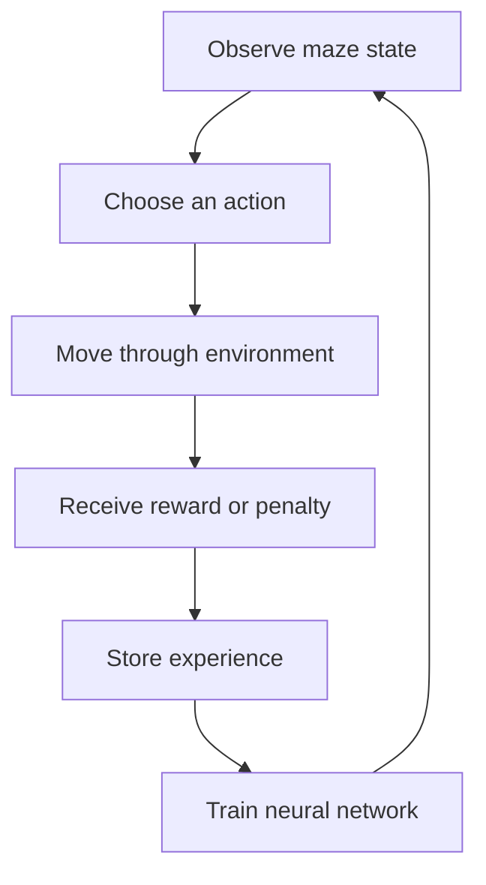

# Deep Q-Learning Treasure Maze

[](https://github.com/PhantomOSG-25/deep-q-learning-treasure-maze/actions/workflows/test.yml)

**Python 3.11 | TensorFlow | NumPy | Deep Q-Learning**

This repository showcases my work with artificial intelligence, neural networks, reinforcement learning, and deep Q-learning. The featured project is an intelligent pirate agent that learns how to navigate an 8x8 maze and reach a treasure.

Instead of receiving a fixed route, the agent learns through repeated interaction with the maze. It explores possible moves, receives rewards or penalties, stores prior experiences, and gradually improves its decisions.

## Project Result

The recorded final notebook run reached a rolling win rate of **1.000** and completed the maze from every valid starting position used in its final evaluation. The exported notebook preserves that result; a fresh training run can vary with random initialization, hardware, and dependency versions.

## How the Agent Learns



- The 8x8 maze is represented using 64 state values.
- The neural network predicts Q-values for four actions: left, up, right, and down.
- Exploration lets the agent try unfamiliar actions.
- Exploitation lets the agent use the strongest action it has learned.
- Experience replay reuses earlier state transitions during training.
- A target network provides more stable learning targets.
- Rewards and penalties encourage progress toward the treasure and discourage ineffective behavior.

## Technical Concepts

| Concept | Role in the project |
| --- | --- |
| Deep Q-network | Estimates the future value of each possible action |
| Epsilon strategy | Balances exploration with learned behavior |
| Experience replay | Trains from stored interactions instead of only the latest move |
| Target network | Reduces instability while Q-values are updated |
| Reward design | Converts successful and unsuccessful behavior into learning signals |

## Maintained Source

- [`dqn_training.py`](dqn_training.py) - extracted and refactored DQN training and evaluation pipeline
- [`TreasureMaze.py`](TreasureMaze.py) - maze environment used by the agent
- [`GameExperience.py`](GameExperience.py) - bounded replay memory and Bellman-target generation
- [`tests`](tests) - unit tests for movement, rewards, terminal states, replay memory, and Q-target calculations
- [`requirements.txt`](requirements.txt) - reproducible training dependencies
- [`requirements-test.txt`](requirements-test.txt) - lightweight CI dependency

The maintained environment corrects an invalid-action state bug in the original starter component. Replay memory now validates transitions, rejects empty sampling, normalizes state shapes, and enforces a bounded memory size.

## Run the Project

The environment used for the original notebook was Python 3.11 with NumPy 1.26.4. To create a compatible local environment:

```bash
python3.11 -m venv .venv
source .venv/bin/activate
python -m pip install --upgrade pip
python -m pip install -r requirements.txt
```

Run a training session and save the resulting model:

```bash
python dqn_training.py --epochs 15000 --seed 42 --output treasure_maze.keras
```

Training is CPU-intensive and may take substantial time. For a quick pipeline check, use a smaller epoch count; a short run is not expected to reproduce the final win rate.

Run the environment and replay-memory tests:

```bash
python -m pip install -r requirements-test.txt
python -m unittest discover -s tests -v
```

Continuous integration runs the lightweight tests without installing TensorFlow. It validates the maze and replay components but does not claim to retrain the neural network on every commit.

## Contribution Scope

`TreasureMaze.py` and `GameExperience.py` began as course-provided starter components. My project work focused on completing and debugging the deep Q-learning training loop, connecting exploration and exploitation to replay memory, updating a target network, evaluating the learned policy, and defending the design. The maintained portfolio version also corrects and tests the supporting components so the complete system can be reviewed directly.

## Featured Files

- [`dqn_training.py`](dqn_training.py) - reviewable Python implementation extracted from the final notebook
- [`TreasureMaze.py`](TreasureMaze.py) and [`GameExperience.py`](GameExperience.py) - supporting environment and replay components
- [`Wood_Michael_ProjectTwo.html`](CS_370_Current_Emerging_Trends_in_CS/Week_7/Wood_Michael_ProjectTwo.html) - completed notebook export containing the final project
- [`7_1_Project_Two_Design_Defense.docx`](CS_370_Current_Emerging_Trends_in_CS/Week_7/7_1_Project_Two_Design_Defense.docx) - explanation and defense of the selected design
- [`CS_370_Current_Emerging_Trends_in_CS`](CS_370_Current_Emerging_Trends_in_CS) - supporting weekly AI and machine-learning coursework

## What I Learned

This project helped me understand the difference between programming a solution and building an agent that can learn a solution. I approached training much like troubleshooting a real system: test an idea, inspect the results, adjust the settings, and continue until the behavior becomes reliable.

It also strengthened my understanding of how exploration, exploitation, reward signals, neural networks, stored experience, and parameter choices work together.

## Skills Demonstrated

Python, TensorFlow, Keras, neural networks, reinforcement learning, deep Q-learning, model training, experiment analysis, debugging, and technical communication.

## Author

Michael B. Wood  
Bachelor of Science in Computer Science, Software Engineering concentration  
Southern New Hampshire University | Coursework completing August 2026  
Planning graduate study in Artificial Intelligence beginning September 2026
