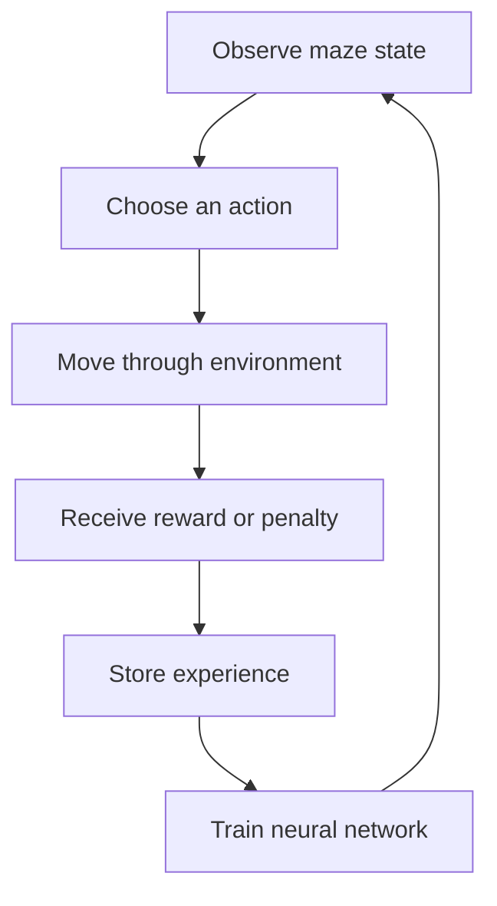

# Deep Q-Learning Treasure Maze

**CS-370 Current and Emerging Trends | Python, TensorFlow, Keras, Reinforcement Learning**

This repository showcases my work with artificial intelligence, neural networks, reinforcement learning, and deep Q-learning. The featured project is an intelligent pirate agent that learns how to navigate an 8x8 maze and reach a treasure.

Instead of receiving a fixed route, the agent learns through repeated interaction with the maze. It explores possible moves, receives rewards or penalties, stores prior experiences, and gradually improves its decisions.

## Project Result

The trained agent reached a rolling win rate of **1.000** and completed the maze from every valid starting position used in the final evaluation.

## How the Agent Learns

- The 8x8 maze is represented using 64 state values.
- The neural network predicts Q-values for four actions: left, up, right, and down.
- Exploration lets the agent try unfamiliar actions.
- Exploitation lets the agent use the strongest action it has learned.
- Experience replay reuses earlier state transitions during training.
- A target network provides more stable learning targets.
- Rewards and penalties encourage progress toward the treasure and discourage ineffective behavior.

## Technical Concepts

| Concept | Role in the project |
| --- | --- |
| Deep Q-network | Estimates the future value of each possible action |
| Epsilon strategy | Balances exploration with learned behavior |
| Experience replay | Trains from stored interactions instead of only the latest move |
| Target network | Reduces instability while Q-values are updated |
| Reward design | Converts successful and unsuccessful behavior into learning signals |

## Featured Files

- [`Wood_Michael_ProjectTwo.html`](CS_370_Current_Emerging_Trends_in_CS/Week_7/Wood_Michael_ProjectTwo.html) - completed notebook export containing the final project
- [`7_1_Project_Two_Design_Defense.docx`](CS_370_Current_Emerging_Trends_in_CS/Week_7/7_1_Project_Two_Design_Defense.docx) - explanation and defense of the selected design
- [`CS_370_Current_Emerging_Trends_in_CS`](CS_370_Current_Emerging_Trends_in_CS) - supporting weekly AI and machine-learning coursework

## What I Learned

This project helped me understand the difference between programming a solution and building an agent that can learn a solution. I approached training much like troubleshooting a real system: test an idea, inspect the results, adjust the settings, and continue until the behavior becomes reliable.

It also strengthened my understanding of how exploration, exploitation, reward signals, neural networks, stored experience, and parameter choices work together.

## Skills Demonstrated

Python, TensorFlow, Keras, neural networks, reinforcement learning, deep Q-learning, model training, experiment analysis, debugging, and technical communication.

## Author

Michael B. Wood  
Bachelor of Science in Computer Science, Software Engineering concentration  
Southern New Hampshire University | Coursework completing August 2026  
Planning graduate study in Artificial Intelligence beginning September 2026
